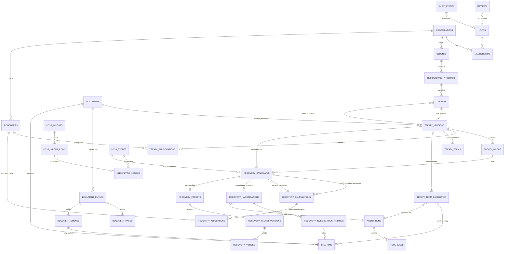

# Cedeon — Data Model

PostgreSQL is the system of record. This document defines the MVP schema, the
versioning / immutability rules, and the provenance model.

---

## 1. Principles

- **Relational for anything queried, constrained, or financially material.** JSONB
  only for: raw import rows, AI request/response envelopes, calculation traces,
  structured AI outputs, immutable snapshots, `external_refs`.
- **Money:** `NUMERIC(20, 2)` columns (whole-cent). Python computes in `Decimal` at
  higher precision and quantizes to 2dp at persistence / allocation boundaries.
  Every money column has a sibling `currency CHAR(3)` (ISO 4217). No implicit FX.
- **Shares / percentages:** `NUMERIC(9, 6)` in `[0, 1]` (e.g. `0.500000`).
- **Timestamps:** `TIMESTAMPTZ`, always UTC.
- **IDs:** UUIDv7 (time-ordered), generated in the application for portability.
- **Tenancy:** every table below the org has a non-null `organization_id` FK.
  Composite FKs / query-layer scoping ensure children cannot cross tenants.
- **Constraints are load-bearing:** FKs, `UNIQUE`, `CHECK` (non-negative money,
  `attachment >= 0`, `limit > 0`, share ranges, incurred consistency), partial
  indexes for queue lookups.
- **`updated_at`** on mutable rows; immutable rows have `created_at` only.

## 2. Versioning & immutability

| Entity | Rule |
| --- | --- |
| `documents` | **Immutable.** New upload = new row. `sha256` dedupe within org. |
| `document_parses`, `document_pages`, `document_chunks` | Immutable outputs of a parse run. Re-parsing creates a new `document_parses` + fresh pages/chunks; old ones retained, marked superseded. |
| `treaty_versions` | The **immutable unit of executable truth**. Mutable only while `status ∈ {DRAFT, PARSING, EXTRACTION_COMPLETE, NEEDS_VALIDATION}`. Once `VALIDATED`, frozen. A post-validation change creates a new `treaty_versions` row (`version_no + 1`), old one → `SUPERSEDED`. `treaties.current_version_id` points at the live one. |
| `treaty_layers`, `treaty_participations`, `treaty_terms` | Belong to a `treaty_version`; follow its freeze. |
| `treaty_term_candidates` | Immutable AI output. |
| `reviews` | **Append-only.** Never updated or deleted. |
| `underlying_losses` | Immutable snapshot of a committed import row. Corrections = new import + new rows; superseded losses excluded from calculations by a status flag. |
| `recovery_calculations`, `recovery_allocations` | **Immutable.** Recalculation = new `recovery_calculations` row; `recovery_candidates.current_calculation_id` moves. |
| `recovery_investigations` | Immutable per agent run. |
| `recovery_packet_versions` | Immutable; new version on regenerate. |
| `agent_runs`, `tool_calls`, `model_usage` | Immutable telemetry. |
| `audit_events` | **Append-only.** Enforced by a `BEFORE UPDATE OR DELETE` trigger that raises. |

This is **not** event sourcing. Mutable current-state tables exist; immutable
snapshots and an append-only audit log sit alongside them.

## 3. Provenance model

`citations` is a first-class, reusable entity — the backbone of auditability.

```
citations(
  id, organization_id,
  document_id            → documents,
  page_number,
  section,               -- e.g. "Article IV — Limit and Retention"
  quoted_text,           -- the exact supporting span
  char_start, char_end,  -- offsets within the page/chunk text
  bbox        JSONB NULL,-- {page, x0, y0, x1, y1} where the parser provides it
  chunk_id    NULL       → document_chunks,
  created_at
)
```

Referenced by: `treaty_term_candidates.citation_id`,
`recovery_investigation_findings.citation_id`, and packet statement entries. Any AI
conclusion shown to a user without a resolvable citation is a bug.

Provenance on an extracted term:

```
treaty_term_candidates(
  id, organization_id, treaty_version_id, extraction_run_id,
  key,                       -- canonical term key, e.g. "attachment"
  raw_value,                 -- verbatim model string
  normalized_value  JSONB,   -- typed: {amount:"50000000.00", currency:"USD"}
  status,                    -- EXTRACTED | NOT_FOUND | AMBIGUOUS | CONFLICTING
  confidence        NUMERIC(4,3),
  citation_id       NULL → citations,
  alternatives      JSONB NULL,  -- for AMBIGUOUS/CONFLICTING: other candidate readings
  extraction_model, extraction_provider, prompt_version,
  created_at
)
```

## 4. Entity catalogue (MVP)

**Identity & tenancy**
`organizations` · `users` (`password_hash` nullable) · `memberships` (role:
owner/admin/member/viewer) · `sessions` (server-side, `token_hash`, `expires_at`,
`revoked_at`).

**Reinsurance structure**
`cedents` · `reinsurance_programs` (`treaty_year`) · `reinsurers` · `brokers` ·
`treaties` (`treaty_type`, `status`, `current_version_id`) · `treaty_versions`
(`version_no`, `source_document_id`, `status`, `effective_date`, `expiration_date`,
`currency`, `validated_by`, `validated_at`) · `treaty_layers` (`layer_no`,
`attachment`, `limit`, `currency`, `reinstatements` nullable) · `treaty_participations`
(`reinsurer_id`, `broker_id` nullable, `placed_share`, `signed_share`) ·
`treaty_terms` (`key`, `value` JSONB, `currency` nullable, `status`,
`derived_from_candidate_id`, `review_id`; `UNIQUE(treaty_version_id, key)`).

**Documents & retrieval** *(built in Phase 2; migration 0002)*
`documents` (immutable: `kind`, `original_filename`, `content_type`, `byte_size`,
`sha256`, `storage_key`, `status`, `uploaded_by`; `UNIQUE(organization_id, sha256)`
dedupes re-uploads) ·
`document_parses` (one per parse run: `parser_name`, `parser_version`, `status`,
`page_count`, `ocr_used`, `error`, `started_at`/`finished_at`, `superseded_at`) ·
`document_pages` (`parse_id`, `page_number`, `width`, `height`, `text`;
`UNIQUE(parse_id, page_number)`; invariant `text == "\n".join(block texts)`) ·
`document_chunks` (`parse_id`, `ordinal`, `page_from`, `page_to`, `section_path`,
`heading`, `text`, `char_start`/`char_end` into the document's full text;
`UNIQUE(parse_id, ordinal)`) · `citations`.
Embeddings (`embedding halfvec(N)`, `embedding_model`) and the `vector` extension
are **deferred to Phase 3** so the dimension matches the chosen model.

**Losses**
`loss_imports` (`storage_key`, `sha256`, `column_mapping` JSONB, `status`, `report`
JSONB) · `loss_import_rows` (`row_number`, `raw` JSONB, `parsed` JSONB, `errors`
JSONB, `status`) · `loss_events` (`name`, `event_identifier` nullable,
`catastrophe_code` nullable, `date_of_loss_from/to`, `currency`) ·
`underlying_losses` (`claim_id`, `loss_event_id` nullable, `date_of_loss`,
`reported_date`, `gross_paid`, `gross_case_reserve`, `gross_incurred`, `currency`,
`status`, `cause_of_loss`, `location`, `description`;
`CHECK (gross_incurred = gross_paid + gross_case_reserve)` tolerance-checked).

**Recovery**
`recovery_candidates` (`treaty_version_id`, `treaty_layer_id`, `loss_event_id`,
`status`, `currency`, `gross_event_incurred`, `current_calculation_id`) ·
`recovery_calculations` (`engine_version`, `treaty_version_id`, `treaty_layer_id`,
`inputs` JSONB, `gross_loss`, `attachment`, `amount_above_attachment`, `layer_limit`,
`layer_recovery`, `trace` JSONB, `input_hash`) · `recovery_allocations`
(`recovery_calculation_id`, `reinsurer_id`, `participation_share`,
`allocated_recovery`, `rounding_adjustment`) ·
`recovery_investigations` (`agent_run_id`, `status`, `summary`,
`applicability_assessment`, `confidence`, `output` JSONB) ·
`recovery_investigation_findings` (`investigation_id`, `kind`, `text`,
`citation_id` nullable, `ordinal`) ·
`recovery_packets` (`recovery_candidate_id`, `current_version_id`) ·
`recovery_packet_versions` (`version_no`, `content` JSONB, `calculation_id`,
`investigation_id` nullable, `rendered_html` nullable, `status`) ·
`recovery_notices` (`kind`, `status`, `recipient` JSONB, `body_markdown`,
`agent_run_id`, `approved_by` nullable, `approved_at`) — **never auto-sent in MVP**.

**Review & audit**
`reviews` (`subject_type`, `subject_id`, `reviewer_id`, `decision`, `value_before`
JSONB, `value_after` JSONB, `reason`, `created_at`) — append-only ·
`audit_events` (`occurred_at`, `actor_type` user/system/agent, `actor_id` nullable,
`action`, `entity_type`, `entity_id`, `summary`, `payload` JSONB, `correlation_id`)
— append-only.

**AI telemetry**
`prompt_versions` (`name`, `version`, `template`, `output_schema_ref`,
`created_at`; seeded from code) ·
`agent_runs` (`agent_type` treaty_extraction/recovery_investigator/notice_drafter,
`subject_type`, `subject_id`, `provider`, `model`, `prompt_version`, `status`,
`input_ref` JSONB, `output` JSONB, `input_tokens`, `output_tokens`, `cost_usd`
nullable, `latency_ms`, `error`, `started_at`, `finished_at`, `correlation_id`) ·
`tool_calls` (`agent_run_id`, `ordinal`, `tool_name`, `arguments` JSONB,
`result_summary` JSONB, `status`, `latency_ms`).

**Jobs:** managed by Procrastinate's own tables; domain entity `status` columns are
the user-visible progress signal.

## 5. ERD (core spine)



`reviews` and `audit_events` reference many subjects polymorphically
(`subject_type`/`subject_id`, `entity_type`/`entity_id`) and are drawn only against
`users` above to keep the diagram legible.

## 6. Calculation golden cases (schema-level contract)

Treaty `$20M xs $50M`, USD:

| Gross event incurred | `amount_above_attachment` | `layer_recovery` |
| --- | --- | --- |
| 30,000,000.00 | 0.00 | 0.00 |
| 50,000,000.00 | 0.00 | 0.00 |
| 55,000,000.00 | 5,000,000.00 | 5,000,000.00 |
| 58,700,000.00 | 8,700,000.00 | **8,700,000.00** |
| 70,000,000.00 | 20,000,000.00 | 20,000,000.00 |
| 100,000,000.00 | 50,000,000.00 | 20,000,000.00 |

Allocation of `8,700,000.00` — Alpha 0.50 / Beta 0.30 / Gamma 0.20:
`4,350,000.00 / 2,610,000.00 / 1,740,000.00`, and
`Σ allocated_recovery == layer_recovery` exactly (penny-allocation on any residual).

Property assertions: `0 ≤ layer_recovery ≤ limit`; monotonic non-decreasing in
`gross_loss`; negative inputs rejected; `Σ shares` validated (`≤ 1 + ε`).

## 7. Deferred model surface (do not build)

Aggregate structures · inuring order · reinstatement waterfalls · hours-clause /
event-window clustering · cat-event grouping · FX / multi-currency conversion ·
retrocession chains · settlement / cash-ledger · Schedule F · assumed reinsurance.
Where a hook is cheap and honest (`treaty_type` enum, `external_refs` JSONB,
`treaty_layers` as a list rather than scalar columns), it is included. Nothing
speculative beyond that.
