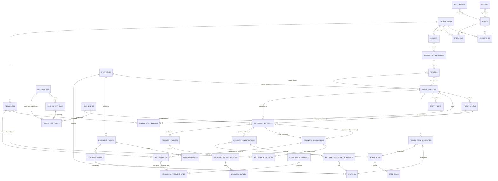

# Cedeon — Data Model

PostgreSQL is the system of record. This document defines the MVP schema, the
versioning / immutability rules, and the provenance model.

---

## 1. Principles

- **Relational for anything queried, constrained, or financially material.** JSONB
  only for: raw import rows, AI request/response envelopes, calculation traces,
  structured AI outputs, immutable snapshots, `external_refs`.
- **Money:** `NUMERIC(20, 2)` columns (whole-cent). Python computes in `Decimal` at
  higher precision and quantizes to 2dp at persistence / allocation boundaries.
  Every money column has a sibling `currency CHAR(3)` (ISO 4217). No implicit FX.
- **Shares / percentages:** `NUMERIC(9, 6)` in `[0, 1]` (e.g. `0.500000`).
- **Timestamps:** `TIMESTAMPTZ`, always UTC.
- **IDs:** UUIDv7 (time-ordered), generated in the application for portability.
- **Tenancy:** every table below the org has a non-null `organization_id` FK.
  Composite FKs / query-layer scoping ensure children cannot cross tenants.
- **Constraints are load-bearing:** FKs, `UNIQUE`, `CHECK` (non-negative money,
  `attachment >= 0`, `limit > 0`, share ranges, incurred consistency), partial
  indexes for queue lookups.
- **`updated_at`** on mutable rows; immutable rows have `created_at` only.

## 2. Versioning & immutability

| Entity | Rule |
| --- | --- |
| `documents` | **Immutable.** New upload = new row. `sha256` dedupe within org. |
| `document_parses`, `document_pages`, `document_chunks` | Immutable outputs of a parse run. Re-parsing creates a new `document_parses` + fresh pages/chunks; old ones retained, marked superseded. |
| `treaty_versions` | The **immutable unit of executable truth**. Mutable only while `status ∈ {DRAFT, PARSING, EXTRACTION_COMPLETE, NEEDS_VALIDATION}`. Once `VALIDATED`, frozen. A post-validation change creates a new `treaty_versions` row (`version_no + 1`), old one → `SUPERSEDED`. `treaties.current_version_id` points at the live one. |
| `treaty_layers`, `treaty_participations`, `treaty_terms` | Belong to a `treaty_version`; follow its freeze. |
| `treaty_term_candidates` | Immutable AI output. |
| `reviews` | **Append-only.** Never updated or deleted. |
| `memberships` | Mutable `role`; deleting one revokes access, keeps the user + their history. |
| `invitations` | `status` and `token_hash` mutable (revoke, resend); single-use once `accepted`. |
| `underlying_losses` | Immutable snapshot of a committed import row. Corrections = new import + new rows; superseded losses excluded from calculations by a status flag. |
| `recovery_calculations`, `recovery_allocations` | **Immutable.** Recalculation = new `recovery_calculations` row; `recovery_candidates.current_calculation_id` moves. |
| `recovery_investigations` | Immutable per agent run. |
| `recovery_packet_versions` | Immutable; new version on regenerate. |
| `recoverables` | Mutable current-state (collection tracking): `status` + `agreed`/`billed`/`collected`/`due_date`/`note` are human facts, every change audited. `expected_amount` is a frozen fact. |
| `reinsurer_statements` | Header + `label`/`currency`/`statement_date`. |
| `reinsurer_statement_lines` | The reconciliation output — `findings` JSONB frozen at reconcile time; `resolved` bool is the one mutable field (a human clears a handled line). |
| `agent_runs`, `tool_calls`, `model_usage` | Immutable telemetry. |
| `audit_events` | **Append-only.** Enforced by a `BEFORE UPDATE OR DELETE` trigger that raises. |

This is **not** event sourcing. Mutable current-state tables exist; immutable
snapshots and an append-only audit log sit alongside them.

## 3. Provenance model

`citations` is a first-class, reusable entity — the backbone of auditability.

```
citations(
  id, organization_id,
  document_id            → documents,
  page_number,
  section,               -- e.g. "Article IV — Limit and Retention"
  quoted_text,           -- the exact supporting span
  char_start, char_end,  -- offsets within the page/chunk text
  bbox        JSONB NULL,-- {page, x0, y0, x1, y1} where the parser provides it
  chunk_id    NULL       → document_chunks,
  created_at
)
```

Referenced by: `treaty_term_candidates.citation_id`,
`recovery_investigation_findings.citation_id`, and packet statement entries. Any AI
conclusion shown to a user without a resolvable citation is a bug.

Provenance on an extracted term:

```
treaty_term_candidates(
  id, organization_id, treaty_version_id, extraction_run_id,
  key,                       -- canonical term key, e.g. "attachment"
  raw_value,                 -- verbatim model string
  normalized_value  JSONB,   -- typed: {amount:"50000000.00", currency:"USD"}
  status,                    -- EXTRACTED | NOT_FOUND | AMBIGUOUS | CONFLICTING
  confidence        NUMERIC(4,3),
  citation_id       NULL → citations,
  alternatives      JSONB NULL,  -- for AMBIGUOUS/CONFLICTING: other candidate readings
  extraction_model, extraction_provider, prompt_version,
  created_at
)
```

## 4. Entity catalogue (MVP)

**Identity & tenancy** *(migration 0001; `invitations` added in 0017; `signup_codes`
+ org AI-budget columns in 0018)*
`organizations` (`name`, `slug` unique — the stable identity, never renamed;
`ai_budget_usd` **nullable** = monthly AI-spend cap, NULL = unlimited;
`ai_budget_notified_at` — dedupes the ops alert to one per month — ADR-0028) ·
`users` (`email` unique lower-cased, `password_hash` **nullable** — SSO seam, `name`,
`is_active`, `last_login_at`; **no `organization_id`** — org membership is
first-class) · `memberships` (`organization_id`, `user_id`, `role`
**`admin` / `member`** *(`viewer` reserved, unused — ADR-0026)*;
`UNIQUE(organization_id, user_id)`; a user may hold more than one) ·
`invitations` (`organization_id`, `email`, `role`, `token_hash` — HMAC not plaintext,
`status` pending/accepted/revoked, `invited_by_user_id` `SET NULL`, `expires_at`,
`accepted_at`; **partial unique index** `(organization_id, email) WHERE status
= 'PENDING'` — one live invite per email per org; single-use, bound to the email) ·
`signup_codes` (operator-minted access codes — `code_hash` HMAC unique, `label`,
`max_uses` / `redeemed_count`, `grant_ai_budget_usd`, `expires_at`, `revoked_at`;
gate org creation when `CEDEON_SIGNUP_MODE=code` — ADR-0028) ·
`sessions` (server-side, `token_hash`, `organization_id` + `user_id`, `expires_at`,
`revoked_at`, `last_seen_at` idle timeout).

**Reinsurance structure** *(built in Phase 3; migration 0003)*
`cedents` · `reinsurance_programs` (`treaty_year`) · `reinsurers` · *(`brokers`
deferred — `treaty_participations.broker_name` for now)* · `treaties` (`treaty_type`,
`current_version_id` — circular FK added post-create) · `treaty_versions`
(`version_no`, `source_document_id`, `status` DRAFT→PARSING→EXTRACTING→
NEEDS_VALIDATION→VALIDATED→ACTIVE→SUPERSEDED, `effective_date`, `expiration_date`,
`currency`, `validated_by`, `validated_at`; `UNIQUE(treaty_id, version_no)`;
immutable once `status.is_frozen`) · `treaty_layers` (`layer_no`, `attachment`,
`limit` `NUMERIC(20,2)`, `currency`, `reinstatements` nullable; **reinstatement
premium terms — human-validated, never AI —** `deposit_premium` `MONEY` nullable,
`reinstatement_rates` JSONB nullable *(rate per reinstatement, e.g. `["1","1"]`)*,
`reinstatement_basis` `flat`/`pro_rata_time` nullable; migration 0015) ·
`treaty_participations` (`reinsurer_id`, `treaty_layer_id` **nullable** — NULL is the
programme-wide panel, a layer id overrides it for that one layer (migration 0014);
`broker_name` nullable, `placed_share`, `signed_share` `NUMERIC(9,6)`; two partial
unique indexes — `(version, reinsurer) WHERE layer_id IS NULL` and
`(version, layer, reinsurer) WHERE layer_id IS NOT NULL`) ·
`treaty_terms` (`key`, `value` JSONB, `currency` nullable, `status`
CONFIRMED/AMBIGUOUS/REJECTED, `derived_from_candidate_id`, `review_id`;
`UNIQUE(treaty_version_id, key)`).

**AI extraction & validation** *(built in Phase 3; migration 0004)*
`prompt_versions` (`name`, `version`, `template`; `UNIQUE(name, version)`) ·
`agent_runs` (immutable telemetry: `agent_type`, `subject_type`/`subject_id`,
`provider`, `model`, `prompt_version`, `status`, `input_ref` JSONB, `output` JSONB,
`input_tokens`, `output_tokens`, `cost_usd`, `latency_ms`, `error`,
`started_at`/`finished_at`, `correlation_id`) ·
`citations` (`document_id`, `page_number`, `section`, `quoted_text`, `char_start/end`,
`chunk_id` nullable) ·
`treaty_term_candidates` (immutable AI output: `treaty_version_id`, `agent_run_id`,
`key`, `status` extracted/not_found/ambiguous/conflicting, `raw_value`,
`normalized_value` JSONB, `currency`, `confidence` `NUMERIC(4,3)`, `citation_id`
nullable, `reasoning`, `resolution` set by review) ·
`reviews` (**append-only**: `subject_type`/`subject_id`, `reviewer_id`, `decision`
confirm/edit/reject/mark_ambiguous/request_info, `value_before`/`value_after` JSONB,
`reason`).

**Documents & retrieval** *(built in Phase 2; migration 0002)*
`documents` (immutable: `kind`, `original_filename`, `content_type`, `byte_size`,
`sha256`, `storage_key`, `status`, `uploaded_by`; `UNIQUE(organization_id, sha256)`
dedupes re-uploads) ·
`document_parses` (one per parse run: `parser_name`, `parser_version`, `status`,
`page_count`, `ocr_used`, `error`, `started_at`/`finished_at`, `superseded_at`) ·
`document_pages` (`parse_id`, `page_number`, `width`, `height`, `text`;
`UNIQUE(parse_id, page_number)`; invariant `text == "\n".join(block texts)`) ·
`document_chunks` (`parse_id`, `ordinal`, `page_from`, `page_to`, `section_path`,
`heading`, `text`, `char_start`/`char_end` into the document's full text;
`UNIQUE(parse_id, ordinal)`) · `citations`.
Embeddings (`embedding halfvec(N)`, `embedding_model`) and the `vector` extension
are **deferred to Phase 3** so the dimension matches the chosen model.

**Losses** *(built in Phase 5; migration 0005 — no AI in this pipeline)*
`loss_imports` (immutable raw file: `original_filename`, `content_type`,
`storage_key`, `sha256` + `UNIQUE(organization_id, sha256)` dedupe, `row_count`,
`header_columns` JSONB, `column_mapping` JSONB `field→column`, `status`
uploaded/mapped/validated/committed/failed, `report` JSONB, `uploaded_by`,
`committed_at`) ·
`loss_import_rows` (`row_number`, `raw` JSONB *(never mutated)*, `parsed` JSONB,
`status` ok/warning/error/skipped, `issues` JSONB `[{row_number,level,field,message}]`;
`UNIQUE(loss_import_id, row_number)`) ·
`loss_events` (`name`, `event_identifier` nullable, `catastrophe_code` nullable,
`program_id` nullable, `date_of_loss_from/to`, `currency` nullable — all derived
from committed losses or set manually; `peril` nullable, `hours_clause_hours`
nullable *(migration 0011 — human facts; the hours value drives the assistive
occurrence view, `GET /loss-events/{id}/occurrence-proposal`)*) ·
`underlying_losses` — immutable snapshot of one committed row: (`claim_id`,
`loss_event_id` nullable `SET NULL`, `loss_import_id` / `loss_import_row_id`
**`RESTRICT`** so provenance survives, `date_of_loss`, `reported_date`,
`gross_paid`, `gross_case_reserve`, `gross_incurred` `NUMERIC(20,2) NOT NULL`,
`currency`, `status`, `cause_of_loss`, `location`, `description`;
`UNIQUE(loss_import_row_id)` — a row commits once; `CHECK (gross_incurred >= 0)`).
The paid + case-reserve = incurred relationship is a **tolerance warning in
`validate_rows`**, not a DB CHECK (a row may carry only incurred).

**Recovery** *(candidates + calculations built in Phase 6; migration 0006 — no AI)*
`recovery_candidates` — the mutable review object, **one per**
`(treaty_version_id, treaty_layer_id, loss_event_id)` (`UNIQUE`; re-creating
returns the existing row): (`treaty_id`, `status`
draft/needs_review/in_review/confirmed/rejected/notice_drafted, `currency`,
`gross_event_incurred` `NUMERIC(20,2)`, `currency_mismatch` bool,
`current_calculation_id` → `recovery_calculations` (circular, added post-create),
`knowledge_date` nullable *(migration 0012 — the reference date a
knowledge-triggered notice deadline counts from; the AI never sets it)*,
`drifted_at` + `pre_drift_recovery` nullable *(migration 0013 — stamped when a
committed loss moved the figure without a human; a confirmed candidate reverts to
needs-review)*, `created_by`, `reviewed_at`/`reviewed_by`). FKs to
treaty/version/layer/event are `RESTRICT`. A multi-layer loss opens one candidate
per pierced layer; siblings group as a *programme* on read. Reinstatement premium is
computed on read from the layer's terms + prior erosion (Σ current `layer_recovery`
of earlier confirmed recoveries on the same layer) — not stored. ·
`recovery_calculations` — **immutable**, one row per engine run: (`engine_version`,
`treaty_version_id`, `treaty_layer_id`, frozen `inputs` JSONB, `currency`,
`gross_loss`, `attachment`, `amount_above_attachment`, `layer_limit`,
`layer_recovery`, `cedent_retention`, `total_ceded`, `trace` JSONB, `input_hash`
SHA-256 of all inputs). Recalculation writes a new row only when `input_hash`
differs; `recovery_candidates.current_calculation_id` moves and a `CONFIRMED`
candidate reverts to `NEEDS_REVIEW`. ·
`recovery_allocations` — **immutable**: (`recovery_calculation_id`, `reinsurer_id`
`RESTRICT`, `participation_share` `NUMERIC(9,6)`, `allocated_recovery`
`NUMERIC(20,2)`; `UNIQUE(recovery_calculation_id, reinsurer_id)`). The
largest-remainder penny split already sums to the layer recovery exactly, so a
stored `rounding_adjustment` column is deferred (derivable as
`allocated_recovery − layer_recovery × share` when a reconciliation view needs it). ·
`recovery_investigations` *(Phase 7; migration 0007)* — **immutable** output of one
Recovery Investigator run: (`recovery_candidate_id` CASCADE, `agent_run_id` SET NULL,
`status` running/completed/failed, `summary`, `applicability_assessment`
supported/partially_supported/unclear/contradicted, `confidence`, `out_of_scope`,
`suspected_prompt_injection`, `unresolved_questions` JSONB, `output` JSONB, `error`,
`superseded_at` — newest non-superseded row is current; re-investigating writes a new
row). The agent never computes the recovery. ·
`recovery_investigation_findings` *(Phase 7)* — **immutable**: (`investigation_id`
CASCADE, `ordinal`, `kind` relevant_clause / supporting_evidence /
missing_information / ambiguity / inconsistency / notice_obligation / next_step,
`text`, `confidence`, `citation_id` nullable SET NULL). A must-cite finding whose
quote is not on the cited page loses its citation and is downgraded to an ambiguity
before it is stored (ADR-0011). ·
`recovery_packets` *(Phase 8; migration 0008)* — one per `recovery_candidate_id`
(`UNIQUE`): (`current_version_id` → `recovery_packet_versions` (circular, added
post-create), `human_overrides` JSONB `statement_key → {text, reason, by}`,
`created_by`). Mutable only for those two fields. ·
`recovery_packet_versions` — **immutable**: (`version_no`, `status`
draft/approved/rejected/superseded, `content` JSONB — the classified
`PacketSection[]` / `PacketStatement[]` structure, `rendered_html` — the
self-contained HTML artifact, `calculation_id` `RESTRICT`, `investigation_id`
nullable `SET NULL`, `generated_by`, `review_note`, `approved_by` / `approved_at`,
`superseded_at`; `UNIQUE(recovery_packet_id, version_no)`). Regenerating writes a
new row and supersedes the rest. Each statement is classed **FACT / CALCULATION /
AI_INTERPRETATION / HUMAN_DECISION**; a human edit is a `reviews` row + an entry in
`recovery_packets.human_overrides`, folded into the next generated version. ·
`recovery_notices` *(Phase 9; migration 0009)* — one per recovery candidate:
(`recovery_candidate_id` CASCADE, `recovery_packet_version_id` nullable SET NULL,
`agent_run_id` nullable SET NULL, `kind` initial_loss_advice / reinsurer_notification,
`status` draft/approved/rejected/superseded, `recipient` JSONB, `subject`,
`body_markdown`, `context` JSONB — the whitelist of approved facts that was used,
`key_figures` JSONB, `caveats` JSONB, `used_only_provided_facts` bool,
`notes_for_reviewer`, `generated_by`, `review_note`, `approved_by` / `approved_at`,
`superseded_at`). Mutable while `DRAFT` (a human edits the prose, `reviews` captures
before/after); frozen on approval; re-drafting supersedes the prior notice of that
kind. **There is deliberately no send action** — the drafter is one `output_type`
call with no tools, from a whitelist of approved values, and a notice's terminal
state is `APPROVED` (AI_ARCHITECTURE.md §2c, ADR-0021). **Never auto-sent.**

`recoverables` *(Phase C; migration 0010; ADR-0024)* — one per
`(recovery_candidate_id RESTRICT, reinsurer_id RESTRICT)`, `UNIQUE`. Materialised
from the confirmed recovery's `recovery_calculation_id` (RESTRICT): `expected_amount`
`MONEY` is a fact copied from `recovery_allocations.allocated_recovery` and never
edited; `CHECK expected_amount >= 0`, `CHECK collected_amount >= 0`. `status`
pending / notified / agreed / billed / collected / disputed / written_off, with
`notified_at` / `agreed_at` / `billed_at` / `settled_at` stamps. `agreed_amount`,
`billed_amount`, `collected_amount` (running total), `due_date`, `note` are mutable
human facts — every change writes an `audit_events` row. **Aging is derived, never
stored.** No AI (pure `app/domain/recoveries/collection.py`).
**Reconciliation is derived on read**: `app/domain/recoveries/reconciliation.py`
compares `expected_amount` against `agreed`/`billed`/`collected` and returns typed
findings; a `reconciliation_mismatch` attention item surfaces the top gap.

**Reinsurer statements** *(migration 0016 — the larger Exception module; no AI)*
`reinsurer_statements` (`label`, `currency`, `statement_date` nullable,
`created_by`) — a batch of figures a reinsurer stated. ·
`reinsurer_statement_lines` (`statement_id` CASCADE, `row_number`
`UNIQUE(statement_id, row_number)`, `reinsurer_name`, `reference` nullable,
`currency`, `their_agreed`/`their_paid` `MONEY` nullable, `matched_recoverable_id`
nullable `SET NULL`, `findings` JSONB — the frozen output of
`app/domain/recoveries/statement_reconciliation.py` matching the stated figures
against the recoverable's expected / our-agreed / our-collected, `resolved` bool —
the one mutable field). A `statement_discrepancy` attention item per unresolved
line. Lines are entered directly; a file importer for real bordereau formats is a
later addition (PRODUCT §1a).

**Review & audit**
`reviews` (`subject_type`, `subject_id`, `reviewer_id`, `decision`, `value_before`
JSONB, `value_after` JSONB, `reason`, `created_at`) — append-only ·
`audit_events` (`occurred_at`, `actor_type` user/system/agent, `actor_id` nullable,
`action`, `entity_type`, `entity_id`, `summary`, `payload` JSONB, `correlation_id`)
— append-only.

**AI telemetry**
`prompt_versions` (`name`, `version`, `template`, `output_schema_ref`,
`created_at`; seeded from code) ·
`agent_runs` (`agent_type` treaty_extraction/recovery_investigator/notice_drafter,
`subject_type`, `subject_id`, `provider`, `model`, `prompt_version`, `status`,
`input_ref` JSONB, `output` JSONB, `input_tokens`, `output_tokens`, `cost_usd`
nullable, `latency_ms`, `error`, `started_at`, `finished_at`, `correlation_id`) ·
`tool_calls` *(built Phase 7; migration 0007)* (`agent_run_id` CASCADE, `ordinal`,
`tool_name`, `arguments` JSONB, `result_summary` JSONB, `status` ok/error,
`latency_ms`; `UNIQUE(agent_run_id, ordinal)`) — one row per tool invocation inside
a run, reconstructed from the agent's message history.

**Jobs:** managed by Procrastinate's own tables; domain entity `status` columns are
the user-visible progress signal.

## 5. ERD (core spine)



`reviews` and `audit_events` reference many subjects polymorphically
(`subject_type`/`subject_id`, `entity_type`/`entity_id`) and are drawn only against
`users` above to keep the diagram legible.

## 6. Calculation golden cases (schema-level contract)

Treaty `$20M xs $50M`, USD:

| Gross event incurred | `amount_above_attachment` | `layer_recovery` |
| --- | --- | --- |
| 30,000,000.00 | 0.00 | 0.00 |
| 50,000,000.00 | 0.00 | 0.00 |
| 55,000,000.00 | 5,000,000.00 | 5,000,000.00 |
| 58,700,000.00 | 8,700,000.00 | **8,700,000.00** |
| 70,000,000.00 | 20,000,000.00 | 20,000,000.00 |
| 100,000,000.00 | 50,000,000.00 | 20,000,000.00 |

Allocation of `8,700,000.00` — Alpha 0.50 / Beta 0.30 / Gamma 0.20:
`4,350,000.00 / 2,610,000.00 / 1,740,000.00`, and
`Σ allocated_recovery == layer_recovery` exactly (penny-allocation on any residual).

Property assertions: `0 ≤ layer_recovery ≤ limit`; monotonic non-decreasing in
`gross_loss`; negative inputs rejected; `Σ shares` validated (`≤ 1 + ε`).

## 7. Deferred model surface (do not build)

Aggregate structures · inuring order · automated cat-event modelling · FX /
multi-currency conversion · retrocession chains · settlement / cash-ledger ·
Schedule F · assumed reinsurance · a bordereau/statement **file** importer (lines
are entered directly for now) · a generalised `FinancialException` base model.
Where a hook is cheap and honest (`treaty_type` enum, `external_refs` JSONB,
`treaty_layers` as a list, `treaty_participations.treaty_layer_id`), it is included.

**Modelled since the MVP** (2026-09-01 scope expansion, PRODUCT §7): reinstatement
premium terms on a layer + a deterministic engine; an *assistive* hours-clause
occurrence grouping (`app/domain/losses/occurrences.py` — proposes, a human
confirms; no new persistence). Nothing speculative beyond that.
